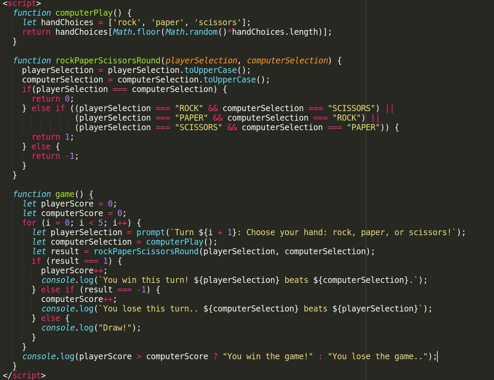

# Rock/Paper/Scissors Project

This project was intended to allow me to practice the Javascript Fundamentals by implementing Rock Paper Scissors in a browser UI game.

This is a project from [The Odin Project](https://www.theodinproject.com/courses/web-development-101/lessons/rock-paper-scissors), and was upgraded in a follow-up [practice exercise](https://www.theodinproject.com/courses/web-development-101/lessons/dom-manipulation) to have a Web UI.

The Code

Screenshot of the Game..

## Pre-Project Thoughts

Nothing really.

## Post-Project Thoughts

Very quick; very easy.
My javascript probably is not as clean as my ruby code.
Bear with me; it'll improve rapidly.
